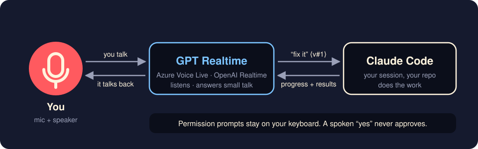
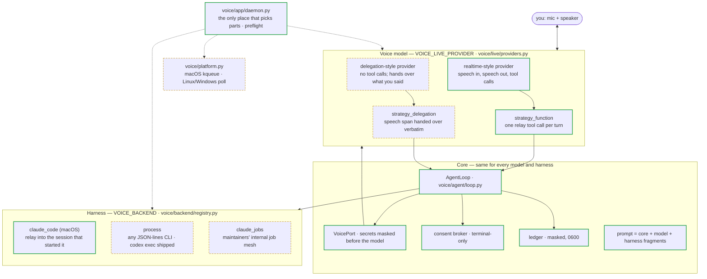

<p align="center">
  <a href="https://pub-e5158abb37d74611a90c9a80bcd9fd9b.r2.dev/bettercallgpt/launch-video/2026-09-29/better-call-gpt-A-r8-16x9.mp4"></a>
</p>

<h1 align="center">Better Call GPT</h1>
<p align="center"><strong>Put Claude Code on a voice call.</strong> Talk while it codes; GPT Realtime talks back.<br>
Full duplex, interrupt anytime, and a spoken “yes” never approves anything.</p>

<p align="center">
  <a href="#install-once"><strong>Install</strong></a>
  &nbsp;&bull;&nbsp;
  <a href="#what-a-call-looks-like"><strong>How it works</strong></a>
  &nbsp;&bull;&nbsp;
  <a href="#safe-by-design"><strong>Safety</strong></a>
  &nbsp;&bull;&nbsp;
  <a href="./README.zh-CN.md"><strong>简体中文</strong></a>
</p>

<p align="center">
  <a href="./LICENSE"></a>
  
  
</p>

<p align="center"><a href="https://pub-e5158abb37d74611a90c9a80bcd9fd9b.r2.dev/bettercallgpt/launch-video/2026-09-29/better-call-gpt-A-r8-16x9.mp4"><strong>▶ Watch the 83-second demo</strong></a></p>

<p align="center">
  
</p>

## Install once

```bash
npx skills add insta-fusion/bettercallgpt -g      # needs Node; macOS + Claude Code
```

Then tell your agent: **“set up bettercallgpt”**. No Node? Paste this into Claude Code instead:
`Set up https://github.com/insta-fusion/bettercallgpt for me.` (it follows [AGENTS.md](AGENTS.md)). It checks for [uv](https://docs.astral.sh/uv/)
and your platform, installs the Claude Code plugin, creates an empty key file and runs a
readiness check. You do two things yourself:

1. **Paste your key** into the file it names (Azure Voice Live; OpenAI Realtime is
   experimental). Setup never asks for the key — don't paste it into the chat.
2. **Type `/bettercallgpt:on`** in a new Claude Code session and approve the start. A rising tone:
   you're live.

Better Call GPT is free and MIT; the voice service bills your own account. Prefer to skip the skill?
Install [uv](https://docs.astral.sh/uv/), type `/plugin marketplace add insta-fusion/bettercallgpt`
and `/plugin install bettercallgpt@bettercallgpt`, fill `~/.config/bettercallgpt/.env` from
[`.env.example`](.env.example), then `/bettercallgpt:on`.

## What a call looks like

- **You talk, it works.** Ask for a fix while you think out loud; your words land in the session
  as a line ending in a `⟨v#…⟩` tag, and the result is read back to you when it lands.
- **Interrupt any time.** Full duplex with barge-in: no push-to-talk, no walkie-talkie turns.
  Ask “how's it going?” mid-task.
- **Small talk stays in the voice.** Only real requests reach the agent.
- **It ends by itself.** Say you're done, type `/bettercallgpt:off`, or stay quiet for 10 minutes
  (not while the agent is still working). A falling tone marks the end.

| Command | Does |
|---|---|
| `/bettercallgpt:on` | start a call attached to this session |
| `/bettercallgpt:status` | one line: phase, relay |
| `/bettercallgpt:off` | end the call |

## Safe by design

- **A spoken “yes” never approves anything.** The voice cannot answer a permission prompt; you
  answer it on the keyboard. (What your agent may already do without asking is still up to your
  Claude Code permission settings.)
- **The start asks you first** — unless Claude Code runs in auto or bypass mode, or an allow rule
  matches it. Don't allow-list it (no `bettercallgpt` wildcard, no broad
  `uvx` rule): it opens your microphone and a paid connection.
- **What leaves your machine:** your microphone audio, and what the voice needs to talk about the
  work (your prompts, the agent's progress and results, permission prompts), go to the voice
  provider you configure. The call ledger stays local (`0600`). See
  [SECURITY.md › Privacy notes](SECURITY.md#privacy-notes).
- **It attaches only to the session that started it**, proven with zero keystrokes, and refuses
  anything else.
- **The plugin is three small command files** ([plugin/commands/](plugin/commands/)) that only
  you can run: no hooks, and the voice process runs only during a call. They run the tagged
  release from GitHub through `uvx`; release tags are published as immutable GitHub releases,
  so a tag cannot be moved after release.

## Works with

| | Today | Not yet |
|---|---|---|
| Agent | **Claude Code CLI on macOS** (proven live), any terminal | Claude desktop app's Code tab (unverified), Cowork (runs in a VM: unsupported), Codex as a child agent (`VOICE_BACKEND=process`, unit-tested) |
| Voice | **Azure Voice Live** (default, proven live, echo-cancelled: speakers OK) | OpenAI Realtime (unit-tested; no echo cancellation: headphones); Azure GPT-Live (short live call; headphones) |
| OS | **macOS** | Linux/Windows: the Claude Code backend's peer check is macOS-only |
| Orca | Works in any [Orca](https://github.com/stablyai/orca) pane; when the pane proves itself (needs the `orca` CLI) the call also tells you when Claude is waiting on a permission prompt | long calls in that mode: unverified |

## More

**Status line (terminal).** `bettercallgpt statusline` prints `🎙 voice` while this session's call
is live (`🎙 voice ↻` while the voice connection is renewed). With the skill's `uvx` setup the
command is `uvx --from git+https://github.com/insta-fusion/bettercallgpt@v0.1.0 bettercallgpt statusline`;
put it in `~/.claude/settings.json` → `statusLine`, or ask your agent to (update the version in it
after an upgrade). The desktop app shows no status line — use `/bettercallgpt:status`.

**Keep voice turns understood after `/compact`:** add [docs/HOST-INSTRUCTIONS.md](docs/HOST-INSTRUCTIONS.md)
to your `CLAUDE.md`.

**Without the plugin.** Install the command once — `uv tool install "git+https://github.com/insta-fusion/bettercallgpt@v0.1.0"` (on Linux also install PortAudio) — or put the `uvx --from …` prefix above in front of every `bettercallgpt` below. Add [docs/HOST-INSTRUCTIONS.md](docs/HOST-INSTRUCTIONS.md) to your
`CLAUDE.md` (or `AGENTS.md`) once, so the agent treats `⟨v#…⟩` lines as you speaking. Then ask
the agent to start voice; it runs, from its own Bash tool:

```sh
NONCE=k7q2m9 bettercallgpt --nonce k7q2m9 start
```

The nonce is any fresh random token, written twice (`NONCE=<n>` and `--nonce <n>`). The
daemon then proves it belongs to the session that started it, with zero keystrokes: it
descends from that session's `claude` process, the session's own transcript holds exactly
one fresh Bash call carrying the nonce, its own environment carries `NONCE=<n>`, and each
nonce binds once. In an [Orca](https://github.com/stablyai/orca) terminal pane, `start` tries
the pane first: when the pane proof holds (the nonce is on that pane's screen inside the running
Bash call), it binds with `--terminal "$ORCA_TERMINAL_HANDLE"` and the daemon reads the pane —
never types into it — so it can tell you when a permission prompt is waiting. Otherwise (no
`orca` CLI, a stale handle, tmux, a headless session) the start proceeds exactly as above.
`bettercallgpt doctor` shows it as `orca_pane`; export `BETTERCALLGPT_ORCA_PANE=0` to skip it.
Approvals are always answered on the keyboard. The session id comes from
`CLAUDE_CODE_SESSION_ID` (`VOICE_SESSION_ID` overrides it). The controls address a session by id: from the agent's own Bash
tool the id is already in the environment, so the agent (or you, by asking it) runs

```sh
bettercallgpt status      # JSON snapshot: phase, relay, relay_count, reconnecting, session, …
bettercallgpt stop
```

From any other shell, pass the id — `bettercallgpt --session <id> stop` — where `<id>` is the
session's `CLAUDE_CODE_SESSION_ID` (the name of its state directory under
`~/.local/state/bettercallgpt/`). Without it the command targets a session named `default`.

## Configuration

Read from the environment first, then the `.env` (never shadowing the real environment).
Installed copies read `~/.config/bettercallgpt/.env` (`$XDG_CONFIG_HOME` when set;
`%APPDATA%\bettercallgpt\.env` on Windows) and keep state in `~/.local/state/bettercallgpt`
(`$XDG_STATE_HOME` when set; `%LOCALAPPDATA%\bettercallgpt` on Windows); a source checkout reads `.env` at its root.

| Name | Default | Meaning |
|---|---|---|
| `AZURE_OPENAI_ENDPOINT`, `AZURE_OPENAI_API_KEY` | — | Azure Voice Live credentials |
| `OPENAI_API_KEY` | — | with `VOICE_LIVE_PROVIDER=openai` |
| `VOICE_LIVE_PROVIDER` | `voice_live` | `voice_live` \| `openai` \| `gpt_live` |
| `VOICE_GPT_LIVE_ENDPOINT`, `VOICE_GPT_LIVE_API_KEY` | — | with `VOICE_LIVE_PROVIDER=gpt_live` (its own Azure resource; use headphones) |
| `VOICE_GPT_LIVE_MODEL` | `gpt-live-1` | GPT-Live deployment |
| `VOICE_TRANSCRIBE_MODEL` | `whisper-1` | Voice Live: speech-to-text model for your side of the call |
| `VOICE_REASONING_EFFORT` | unset | Voice Live: the model's reasoning effort, when set |
| `VOICE_MODEL` | `gpt-realtime-2.1` (`gpt-realtime` on OpenAI) | realtime deployment / model |
| `VOICE_NAME` | `marin` | voice |
| `VOICE_LIVE_VAD` | `azure_semantic_vad` | Voice Live: server turn detection (duplex + barge-in stay on; OpenAI always uses `server_vad`) |
| `VOICE_LIVE_API_VERSION` | `2026-07-15` | Voice Live API version |
| `VOICE_LIVE_HOST` | from the endpoint | Voice Live: host override |
| `VOICE_BACKEND` | `claude_code` | `claude_code` \| `process` \| `claude_jobs` (maintainer-only: needs a job mesh that is not public) |
| `VOICE_PROCESS_ARGV`, `VOICE_PROCESS_DIALECT` | —, `codex_exec` | the child agent for `process` |
| `VOICE_BACKEND_CWD` | current directory | working directory for the `process` / `claude_jobs` agent |
| `VOICE_IDLE_MINUTES` | `10` | quiet minutes before goodbye; `0` = never |
| `VOICE_SESSION_ROLLOVER_MINUTES` | `55` | renew the voice provider session before its own limit (a fresh one takes over with a short recap); `0` = off |
| `VOICE_SESSION_MAX_MINUTES` | none | hard session cap |
| `VOICE_SESSION_ID` | `CLAUDE_CODE_SESSION_ID` | the session every command (`start` and the controls) addresses — **environment only**; precedence `--session` → `VOICE_SESSION_ID` → `CLAUDE_CODE_SESSION_ID` → `default` |
| `VOICE_LISTEN_STATE_DIR` | see above | status + ledger directory — **environment only** (`export`; ignored in `.env`) |

A statusline or any other reader of the daemon's `status.json` must use the same
`VOICE_LISTEN_STATE_DIR` (installed copies default to `~/.local/state/bettercallgpt`).

## How it is built

Solid border = proven in a live call (a provider style: with at least one provider). Dashed = shipped and unit-tested, not yet proven live.
Which providers fill each slot today is in [Works with](#works-with). Want another harness or voice
model? A harness is one `Backend` plus a registry row; a model is one `LiveSession` (+ `Strategy`)
plus a registry row.



Every seam is a protocol: a new voice model is a `LiveSession` + `Strategy` + one row in
`voice/live/providers.py`; a new harness is a `Backend` + one row in
`voice/backend/registry.py`. The daemon is the only module that names concrete parts, and
`bettercallgpt doctor` / `bettercallgpt --status` refuse an unsupported model ×
harness × OS combination before any microphone or paid connection is opened. The voice
model owns meaning (`voice/prompts/`); code decides nothing except consent. The reasons are
in [voice/DESIGN.md](voice/DESIGN.md).

## Tests

```sh
python -m unittest discover -s voice/tests -t . -p 'test_*.py'   # upstream suite, offline
python -m unittest discover -s tests -t . -p 'test_*.py'         # launcher + parity check
python tools/sync_upstream.py check                               # voice/ == UPSTREAM.json
```

The upstream suite is offline and silent, POSIX-only (the process backend sends SIGINT).
One live smoke test (a real `codex exec`) runs only when you opt in with `VOICE_LIVE_TESTS=1`.

## License

MIT — see [LICENSE](LICENSE).
