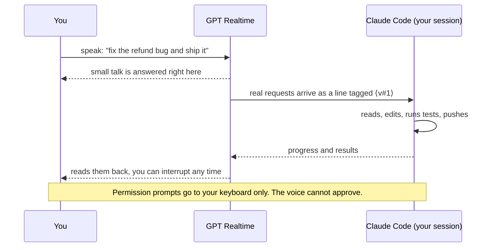

<p align="center">
  <a href="https://pub-e5158abb37d74611a90c9a80bcd9fd9b.r2.dev/bettercallgpt/launch-video/2026-09-29/better-call-gpt-A-r9-16x9.mp4"></a>
</p>

<h3 align="center">Put Claude Code on a voice call</h3>
<p align="center">Talk while it codes. GPT Realtime talks back. A spoken “yes” never approves anything.</p>

<p align="center">
  <a href="https://pub-e5158abb37d74611a90c9a80bcd9fd9b.r2.dev/bettercallgpt/launch-video/2026-09-29/better-call-gpt-A-r9-16x9.mp4"><strong>Demo</strong></a>
  &nbsp;&bull;&nbsp;
  <a href="#install-once"><strong>Install</strong></a>
  &nbsp;&bull;&nbsp;
  <a href="#how-a-call-works"><strong>How it works</strong></a>
  &nbsp;&bull;&nbsp;
  <a href="docs/GUIDE.md"><strong>Guide</strong></a>
  &nbsp;&bull;&nbsp;
  <a href="./README.zh-CN.md"><strong>简体中文</strong></a>
</p>

<p align="center">
  <a href="./LICENSE"></a>
  
  
</p>

## Better Call GPT

Say what you want while you do something else. A realtime voice model keeps the conversation;
only real requests reach your Claude Code session, which does the work in your repo and reports
back by voice. In the launch video: fix a Stripe refund bug, draft an email you approve before it sends,
and learn a Sylas combo, all mid-game.

<p align="center"></p>

<p align="center"><a href="https://pub-e5158abb37d74611a90c9a80bcd9fd9b.r2.dev/bettercallgpt/launch-video/2026-09-29/better-call-gpt-A-r9-16x9.mp4"><strong>▶ 86-second demo with sound</strong></a></p>

## How a call works



1. **Press `Call`** above the prompt (or type `/bettercallgpt:on`). It starts a voice process bound to *this* session only. It proves which
   session started it with zero keystrokes and refuses anything else.
2. **You talk, full duplex, in your language.** It opens in Chinese and answers in whatever
   language you just spoke; English tech words don't switch it. GPT Realtime decides what is chat
   and what is work.
3. **Work is relayed as your words**, tagged `⟨v#n⟩`, so Claude treats it as you speaking.
4. **Results come back by voice** when they land; ask “how's it going?” mid-task.
5. **Said it and Claude is still busy?** Press **`Steer`**: your words go in now and Claude's
   running turn makes way for them.
6. **It ends** when you say so, press `Hang up` (or type `/bettercallgpt:off`), or stay quiet for
   10 minutes.

## Install once

```bash
npx skills add insta-fusion/bettercallgpt -g      # needs Node; macOS + Claude Code
```

Then tell your agent: **“set up bettercallgpt”**. No Node? Paste this into Claude Code instead:
`Set up https://github.com/insta-fusion/bettercallgpt for me.` (it follows [AGENTS.md](AGENTS.md)). It checks for [uv](https://docs.astral.sh/uv/)
and your platform, installs the Claude Code plugin, creates an empty key file and runs a
readiness check. You do two things yourself:

1. **Paste your key** into the file it names (Azure Voice Live; OpenAI Realtime is
   experimental). Setup never asks for the key — don't paste it into the chat.
2. **Press `Call`** above the prompt in a new Claude Code session, after your first message
   (Claude Code 2.1.287+). On an older version type `/bettercallgpt:on` and approve the start.
   A rising tone: you're live.

Better Call GPT is free and MIT; the voice service bills your own account. Prefer to skip the skill?
It is in the official Claude Code plugin directory: install [uv](https://docs.astral.sh/uv/), type
`/plugin install better-call-gpt@anthropic-plugin-directory`, fill `~/.config/bettercallgpt/.env` from
[`.env.example`](.env.example), then `/bettercallgpt:on`. This repository's own marketplace works too:
`/plugin marketplace add insta-fusion/bettercallgpt`, then `/plugin install bettercallgpt@bettercallgpt`.

Or pin the release without the skill: `uv tool install "git+https://github.com/insta-fusion/bettercallgpt@v0.2.0"`.

## Speakers or headphones? Pick the voice model

| | Voice Live (default) | GPT-Live |
|---|---|---|
| Model | `gpt-realtime-2.1` | `gpt-live-1` |
| Echo | The service removes its own voice from your mic (server echo cancellation), so open speakers are fine. | Echo cancellation is not advertised, so the call's start notes “use headphones”. On open speakers it is untested: our own calls on it did not cut themselves off. |
| Keys in `~/.config/bettercallgpt/.env` | `AZURE_OPENAI_ENDPOINT`, `AZURE_OPENAI_API_KEY` | `VOICE_LIVE_PROVIDER=gpt_live`, `VOICE_GPT_LIVE_ENDPOINT`, `VOICE_GPT_LIVE_API_KEY` (its own Azure resource) |

If the AI ever cuts itself off mid-sentence while on speakers, put on headphones or switch to
Voice Live (delete the `VOICE_LIVE_PROVIDER=gpt_live` line).

## Commands

| Command | Does |
|---|---|
| `/bettercallgpt:on` | start a call attached to this session |
| `/bettercallgpt:status` | one line: phase, relay |
| `/bettercallgpt:off` | end the call |
| `Call` · `/call` | start a call with one press, no model turn (Claude Code 2.1.287+) |
| `Steer` · `/steer` | send what you just said now; Claude's running turn makes way |
| `Hang up` · `/hangup` | end the call |

## Safe by design

- **A spoken “yes” never approves anything.** The voice cannot answer a permission request; you
  answer it on the keyboard. (What your agent may already do without asking is still up to your
  Claude Code permission settings.)
- **Starting a call is your act.** Pressing `Call` is your consent. `/bettercallgpt:on` asks you
  first — unless Claude Code runs in auto or bypass mode, or an allow rule
  matches it. Don't allow-list it (no `bettercallgpt` wildcard, no broad
  `uvx` rule): it opens your microphone and a paid connection.
- **What leaves your machine:** your microphone audio, and what the voice needs to talk about the
  work (your prompts, the agent's progress and results, a one-line summary of each permission
  request: tool name and command or file path), go to the voice provider you configure: Azure
  Voice Live, the Azure GPT-Live API, or OpenAI Realtime (experimental). The call ledger stays
  local (`0600`). See
  [SECURITY.md › Privacy notes](SECURITY.md#privacy-notes).
- **It attaches only to the session that started it**, proven with zero keystrokes, and refuses
  anything else.
- **The plugin's commands are three small files** ([plugin/commands/](plugin/commands/)) that only
  you can run, and the voice process runs only during a call. They run the tagged
  release from GitHub through `uvx`; release tags are published as immutable GitHub releases,
  so a tag cannot be moved after release.
- **Plus the call console** ([plugin/hooks/register.tsx](plugin/hooks/register.tsx); needs
  Claude Code 2.1.287+, in the CLI and the desktop app's Code tab). It draws one row above the
  prompt:
  - **`Call`** starts the voice process as a child of your Claude Code process. Your press is
    the consent: no model turn runs and no permission prompt is shown. The voice process
    refuses this kind of start unless Claude Code itself spawned it, so a script running under
    a tool call cannot pass for your press.
  - **`Steer`** sends what you said and the voice has not handed over yet, right now, and ends
    Claude's running turn so your words are read next. The plugin does this only on your press; nothing is
    sent twice. (`bettercallgpt steer` and `stop` are ordinary local commands, like `stop`
    always was: run from a shell they act on this session's call, and when Claude runs one it
    goes through your permission settings.) Words wait unsent only on the GPT-Live voice; on Voice Live (the default)
    each request is handed over as you finish it, and `Steer` brings a waiting message forward.
  - **`Hang up`** ends the call (so does `/clear` or closing the session). `/call`, `/steer`
    and `/hangup` do the same as the buttons; `/call-icons` picks the symbols.
  - During a call the row shows the last 60 characters you said that are not sent yet
    (credentials masked) and how many spoken messages wait in Claude's queue. Both come from
    `status.json` in the call's state directory (`0700`).
  - It never answers a permission request and never changes what a dialog shows. During a
    call, when Claude makes a permission request, it writes `permission.json` (the tool's name
    and one line: the Bash command, the file path or the MCP tool's name) into that state
    directory, so the voice can say what Claude is asking for and that you answer on your
    keyboard. A request can also be one another hook or Claude Code then decides without a
    dialog; sandbox network prompts are not covered.
  - It reads `VOICE_LISTEN_STATE_DIR`, `XDG_STATE_HOME`, `HOME` and `status.json` every
    2 seconds (twice a second during a call) and makes no network request itself. With no
    `bettercallgpt` command installed, `Call` runs the tagged release through `uvx`, as
    `/bettercallgpt:on` does.
  - Turn it off with `"disableAllHooks": true` in your Claude Code settings (that turns off all
    your hooks) or by disabling the plugin in `/plugin`. On an older Claude Code the row is not
    drawn and `/bettercallgpt:on`, `:status` and `:off` work as before.

## Works with

| | Today | Not yet |
|---|---|---|
| Agent | **Claude Code CLI on macOS**, any terminal, and the **Claude desktop app's Code tab** (both proven live) | Cowork (runs in a VM: unsupported), Codex as a child agent (`VOICE_BACKEND=process`, unit-tested) |
| Voice | **Azure GPT Realtime** (`gpt-realtime-2.1` through Azure Voice Live; default, proven live, echo-cancelled: speakers OK) and the **Azure GPT-Live API** (`gpt-live-1`, proven live; headphones) | OpenAI Realtime API (unit-tested; no echo cancellation: headphones) |
| OS | **macOS** | Linux/Windows: the Claude Code backend's peer check is macOS-only |
| Orca | Works in any [Orca](https://github.com/stablyai/orca) pane; when the pane proves itself (needs the `orca` CLI) the call also tells you when Claude is waiting on a permission prompt, using Orca's own agent-wait signal, falling back to reading the pane | long calls in that mode: unverified |

**Want it in another coding agent or CLI** (Codex, Gemini CLI, Cursor, Aider, …) or on another voice model or OS? [Open a support request](https://github.com/insta-fusion/bettercallgpt/issues/new?template=agent-support.yml) and say which one; requests decide what comes next.

## More

Status line, running without the plugin, configuration, how it is built and tests: [docs/GUIDE.md](docs/GUIDE.md).

## License

MIT — see [LICENSE](LICENSE).
