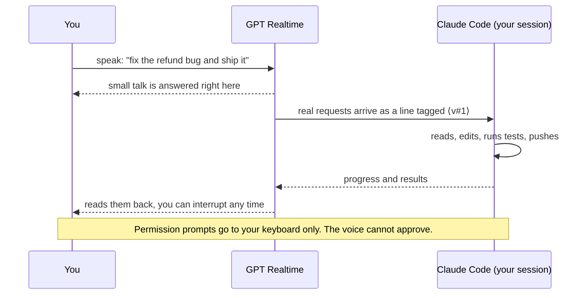

<p align="center">
  <a href="https://pub-e5158abb37d74611a90c9a80bcd9fd9b.r2.dev/bettercallgpt/launch-video/2026-09-29/better-call-gpt-A-r9-16x9.mp4"></a>
</p>

<h3 align="center">Put Claude Code on a voice call</h3>
<p align="center">Talk while it codes. GPT Realtime talks back. A spoken “yes” never approves anything.</p>

<p align="center">
  <a href="https://pub-e5158abb37d74611a90c9a80bcd9fd9b.r2.dev/bettercallgpt/launch-video/2026-09-29/better-call-gpt-A-r9-16x9.mp4"><strong>Demo</strong></a>
  &nbsp;&bull;&nbsp;
  <a href="#install-once"><strong>Install</strong></a>
  &nbsp;&bull;&nbsp;
  <a href="#how-a-call-works"><strong>How it works</strong></a>
  &nbsp;&bull;&nbsp;
  <a href="docs/GUIDE.md"><strong>Guide</strong></a>
  &nbsp;&bull;&nbsp;
  <a href="./README.zh-CN.md"><strong>简体中文</strong></a>
</p>

<p align="center">
  <a href="./LICENSE"></a>
  
  
</p>

## Better Call GPT

Say what you want while you do something else. A realtime voice model keeps the conversation;
only real requests reach your Claude Code session, which does the work in your repo and reports
back by voice. In the launch video: fix a Stripe refund bug, draft an email you approve before it sends,
and learn a Sylas combo, all mid-game.

<p align="center"></p>

<p align="center"><a href="https://pub-e5158abb37d74611a90c9a80bcd9fd9b.r2.dev/bettercallgpt/launch-video/2026-09-29/better-call-gpt-A-r9-16x9.mp4"><strong>▶ 86-second demo with sound</strong></a></p>

## How a call works



1. **`/bettercallgpt:on`** starts a voice process bound to *this* session only. It proves which
   session started it with zero keystrokes and refuses anything else.
2. **You talk, full duplex, in your language.** It opens in Chinese and answers in whatever
   language you just spoke; English tech words don't switch it. GPT Realtime decides what is chat
   and what is work.
3. **Work is relayed as your words**, tagged `⟨v#n⟩`, so Claude treats it as you speaking.
4. **Results come back by voice** when they land; ask “how's it going?” mid-task.
5. **It ends** when you say so, type `/bettercallgpt:off`, or stay quiet for 10 minutes.

## Install once

```bash
npx skills add insta-fusion/bettercallgpt -g      # needs Node; macOS + Claude Code
```

Then tell your agent: **“set up bettercallgpt”**. No Node? Paste this into Claude Code instead:
`Set up https://github.com/insta-fusion/bettercallgpt for me.` (it follows [AGENTS.md](AGENTS.md)). It checks for [uv](https://docs.astral.sh/uv/)
and your platform, installs the Claude Code plugin, creates an empty key file and runs a
readiness check. You do two things yourself:

1. **Paste your key** into the file it names (Azure Voice Live; OpenAI Realtime is
   experimental). Setup never asks for the key — don't paste it into the chat.
2. **Type `/bettercallgpt:on`** in a new Claude Code session and approve the start. A rising tone:
   you're live.

Better Call GPT is free and MIT; the voice service bills your own account. Prefer to skip the skill?
Install [uv](https://docs.astral.sh/uv/), type `/plugin marketplace add insta-fusion/bettercallgpt`
and `/plugin install bettercallgpt@bettercallgpt`, fill `~/.config/bettercallgpt/.env` from
[`.env.example`](.env.example), then `/bettercallgpt:on`.

Or pin the release without the skill: `uv tool install "git+https://github.com/insta-fusion/bettercallgpt@v0.1.0"`.

## Speakers or headphones? Pick the voice model

| | Voice Live (default) | GPT-Live |
|---|---|---|
| Model | `gpt-realtime-2.1` | `gpt-live-1` |
| Echo | The service removes its own voice from your mic (server echo cancellation), so open speakers are fine. | Echo cancellation is not advertised, so the call's start notes “use headphones”. On open speakers it is untested: our own calls on it did not cut themselves off. |
| Keys in `~/.config/bettercallgpt/.env` | `AZURE_OPENAI_ENDPOINT`, `AZURE_OPENAI_API_KEY` | `VOICE_LIVE_PROVIDER=gpt_live`, `VOICE_GPT_LIVE_ENDPOINT`, `VOICE_GPT_LIVE_API_KEY` (its own Azure resource) |

If the AI ever cuts itself off mid-sentence while on speakers, put on headphones or switch to
Voice Live (delete the `VOICE_LIVE_PROVIDER=gpt_live` line).

## Commands

| Command | Does |
|---|---|
| `/bettercallgpt:on` | start a call attached to this session |
| `/bettercallgpt:status` | one line: phase, relay |
| `/bettercallgpt:off` | end the call |

## Safe by design

- **A spoken “yes” never approves anything.** The voice cannot answer a permission prompt; you
  answer it on the keyboard. (What your agent may already do without asking is still up to your
  Claude Code permission settings.)
- **The start asks you first** — unless Claude Code runs in auto or bypass mode, or an allow rule
  matches it. Don't allow-list it (no `bettercallgpt` wildcard, no broad
  `uvx` rule): it opens your microphone and a paid connection.
- **What leaves your machine:** your microphone audio, and what the voice needs to talk about the
  work (your prompts, the agent's progress and results, permission prompts), go to the voice
  provider you configure. The call ledger stays local (`0600`). See
  [SECURITY.md › Privacy notes](SECURITY.md#privacy-notes).
- **It attaches only to the session that started it**, proven with zero keystrokes, and refuses
  anything else.
- **The plugin is three small command files** ([plugin/commands/](plugin/commands/)) that only
  you can run: no hooks, and the voice process runs only during a call. They run the tagged
  release from GitHub through `uvx`; release tags are published as immutable GitHub releases,
  so a tag cannot be moved after release.

## Works with

| | Today | Not yet |
|---|---|---|
| Agent | **Claude Code CLI on macOS**, any terminal, and the **Claude desktop app's Code tab** (both proven live) | Cowork (runs in a VM: unsupported), Codex as a child agent (`VOICE_BACKEND=process`, unit-tested) |
| Voice | **Azure GPT Realtime** (`gpt-realtime-2.1` through Azure Voice Live; default, proven live, echo-cancelled: speakers OK) and the **Azure GPT-Live API** (`gpt-live-1`, proven live; headphones) | OpenAI Realtime API (unit-tested; no echo cancellation: headphones) |
| OS | **macOS** | Linux/Windows: the Claude Code backend's peer check is macOS-only |
| Orca | Works in any [Orca](https://github.com/stablyai/orca) pane; when the pane proves itself (needs the `orca` CLI) the call also tells you when Claude is waiting on a permission prompt, using Orca's own agent-wait signal, falling back to reading the pane | long calls in that mode: unverified |

**Want it in another coding agent or CLI** (Codex, Gemini CLI, Cursor, Aider, …) or on another voice model or OS? [Open a support request](https://github.com/insta-fusion/bettercallgpt/issues/new?template=agent-support.yml) and say which one; requests decide what comes next.

## More

Status line, running without the plugin, configuration, how it is built and tests: [docs/GUIDE.md](docs/GUIDE.md).

## License

MIT — see [LICENSE](LICENSE).
