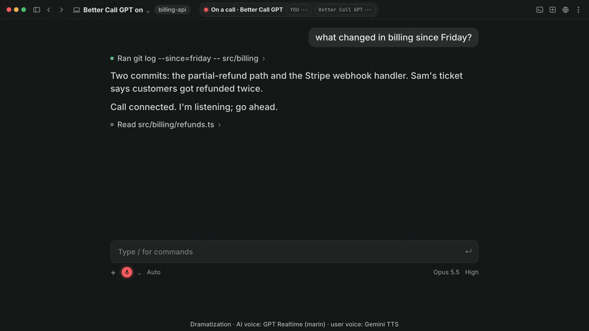
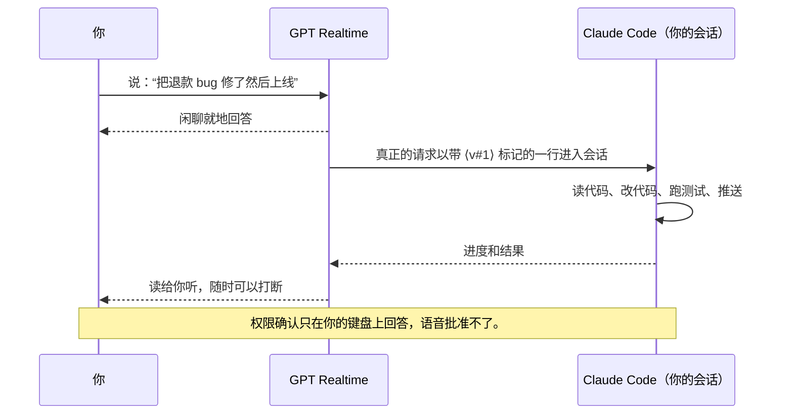

<p align="center">
  <a href="https://pub-e5158abb37d74611a90c9a80bcd9fd9b.r2.dev/bettercallgpt/launch-video/2026-09-29/better-call-gpt-A-r9-16x9.mp4"></a>
</p>

<h3 align="center">给 Claude Code 打个语音电话</h3>
<p align="center">它写代码，你直接说；GPT Realtime 会回你。口头说“同意”批准不了任何操作。</p>

<p align="center">
  <a href="https://pub-e5158abb37d74611a90c9a80bcd9fd9b.r2.dev/bettercallgpt/launch-video/2026-09-29/better-call-gpt-A-r9-16x9.mp4"><strong>演示</strong></a>
  &nbsp;&bull;&nbsp;
  <a href="#一次安装"><strong>安装</strong></a>
  &nbsp;&bull;&nbsp;
  <a href="#一通电话怎么运作"><strong>原理</strong></a>
  &nbsp;&bull;&nbsp;
  <a href="docs/GUIDE.md"><strong>指南</strong></a>
  &nbsp;&bull;&nbsp;
  <a href="./README.md"><strong>English</strong></a>
</p>

## Better Call GPT

你手上做着别的事，嘴上说想要什么就行。实时语音模型负责聊天；只有真正的请求才会进你的 Claude Code 会话，
它在你的仓库里干活，再用语音汇报。发布视频里：打着游戏修好 Stripe 退款 bug、起草一封发送前要你过目的邮件，
顺便学会塞拉斯的连招。

<p align="center"></p>

<p align="center"><a href="https://pub-e5158abb37d74611a90c9a80bcd9fd9b.r2.dev/bettercallgpt/launch-video/2026-09-29/better-call-gpt-A-r9-16x9.mp4"><strong>▶ 86 秒有声演示</strong></a></p>

## 一通电话怎么运作



1. **`/bettercallgpt:on`** 启动一个只绑定*当前*会话的语音进程：无需按键就能证明是哪个会话启动了它，其他一律拒绝。
2. **你说话，全双工，用你的语言。** 开口先说中文，之后你上一句用什么语言它就用什么语言回；夹几个英文技术词不会让它换语言。由 GPT Realtime 判断哪些是闲聊、哪些是活。
3. **活以你的原话转进会话**，带 `⟨v#n⟩` 标记，Claude 会把它当作你在说话。
4. **结果出来就用语音告诉你**；干到一半可以问“进度怎么样？”
5. **结束**：说一声“好了”、输入 `/bettercallgpt:off`，或者安静 10 分钟。

## 一次安装

```bash
npx skills add insta-fusion/bettercallgpt -g      # 需要 Node；macOS + Claude Code
```

然后对你的 AI 说：**“帮我装好 bettercallgpt”**。没装 Node？直接把这句贴给 Claude Code：`Set up https://github.com/insta-fusion/bettercallgpt for me.`（它会照 [AGENTS.md](AGENTS.md) 来装）。它会检查 [uv](https://docs.astral.sh/uv/) 和你的系统、装好
Claude Code 插件、建一个空的 key 文件、再跑一遍自检。你自己只做两件事：

1. **把 key 粘进它告诉你的那个文件**（Azure Voice Live；OpenAI Realtime 还在实验阶段）。安装过程不会问你要 key——也别把 key 发到聊天里。
2. **在新开的 Claude Code 会话里输入 `/bettercallgpt:on`**，批准一次启动。听到上扬的提示音，就通上了。

bettercallgpt 免费、MIT 开源；语音服务的费用走你自己的账户。不想用 skill？它已上架 Claude Code 官方插件目录：先装好
[uv](https://docs.astral.sh/uv/)，再输入 `/plugin install better-call-gpt@anthropic-plugin-directory`，
照着 [`.env.example`](.env.example) 填好 `~/.config/bettercallgpt/.env`，再 `/bettercallgpt:on`。也可以用本仓库自己的
marketplace：`/plugin marketplace add insta-fusion/bettercallgpt`，再 `/plugin install bettercallgpt@bettercallgpt`。

## 外放还是耳机？选语音模型

| | Voice Live（默认） | GPT-Live |
|---|---|---|
| 模型 | `gpt-realtime-2.1` | `gpt-live-1` |
| 回声 | 服务端会从麦克风里减掉它自己的声音（服务端回声消除），外放没问题。 | 官方没有标明回声消除，所以启动时会提示“建议戴耳机”。外放未做专门测试：我们自己用它通话时没有出现自己打断自己。 |
| `~/.config/bettercallgpt/.env` 里填 | `AZURE_OPENAI_ENDPOINT`、`AZURE_OPENAI_API_KEY` | `VOICE_LIVE_PROVIDER=gpt_live`、`VOICE_GPT_LIVE_ENDPOINT`、`VOICE_GPT_LIVE_API_KEY`（它自己的 Azure 资源） |

如果开着外放时 AI 偶尔话说一半自己停下，戴上耳机，或者换回 Voice Live
（删掉 `VOICE_LIVE_PROVIDER=gpt_live` 这一行）。

## 命令

| 命令 | 作用 |
|---|---|
| `/bettercallgpt:on` | 在当前会话开始通话 |
| `/bettercallgpt:status` | 一行状态：阶段、连接 |
| `/bettercallgpt:off` | 结束通话 |

## 安全设计

- **口头说“同意”批准不了任何操作。** 语音回答不了权限确认，只能你在键盘上回答。（AI 本来就被允许做的事，仍由你的 Claude Code 权限设置决定。）
- **启动前会先问你**——除非 Claude Code 处于 auto / bypass 模式，或有匹配的白名单规则。别把它加进白名单（不要 `bettercallgpt` 通配，也不要宽泛的 `uvx` 规则）：它会打开麦克风和付费连接。
- **什么会离开你的电脑：** 你的麦克风音频，以及语音需要用来聊工作的内容（你的提示、AI 的进度和结果、权限提示），会发给你配置的语音服务。通话记录留在本地（`0600`）。详见 [SECURITY.md](SECURITY.md#privacy-notes)。
- **只接入启动它的那个会话**，无需按键即可证明归属，其他一律拒绝。
- **插件就是三个小命令文件**（[plugin/commands/](plugin/commands/)），只有你能运行：没有 hook，语音进程只在通话期间运行。它们通过 `uvx` 运行 GitHub 上打了标签的发布版本；发布版本用不可更改的 GitHub release，标签发布后不能再改指。

## 支持范围

| | 现在 | 还没有 |
|---|---|---|
| AI | **macOS 上的 Claude Code CLI**（任意终端）和 **Claude 桌面版的 Code 标签**（都实测可用） | Cowork（跑在虚拟机里：不支持）、Codex 作为子进程（`VOICE_BACKEND=process`，仅单元测试） |
| 语音 | **Azure GPT Realtime**（`gpt-realtime-2.1`，经 Azure Voice Live；默认，实测可用，自带回声消除：外放也行）和 **Azure GPT-Live API**（`gpt-live-1`，实测可用，需戴耳机） | OpenAI Realtime API（仅单元测试，无回声消除：需戴耳机） |
| 系统 | **macOS** | Linux / Windows：Claude Code 后端的进程归属校验目前只支持 macOS |
| Orca | 在任意 [Orca](https://github.com/stablyai/orca) 窗格里都能用；窗格能证明归属时（需要 `orca` 命令），Claude 等你批准时语音会提醒你：用 Orca 自己的 agent-wait 信号，它没报告等待时再读窗格 | 这种模式下的长通话：未验证 |

**想在别的编程 agent 或 CLI 里用**（Codex、Gemini CLI、Cursor、Aider……），或者换别的语音模型、系统？[提一个支持请求](https://github.com/insta-fusion/bettercallgpt/issues/new?template=agent-support.yml)，写上是哪一个；下一步先做呼声最高的。

## 更多

状态栏、不装插件怎么用、配置项、架构和测试见 [docs/GUIDE.md](docs/GUIDE.md)（英文）。

## 许可证

MIT，见 [LICENSE](LICENSE)。
