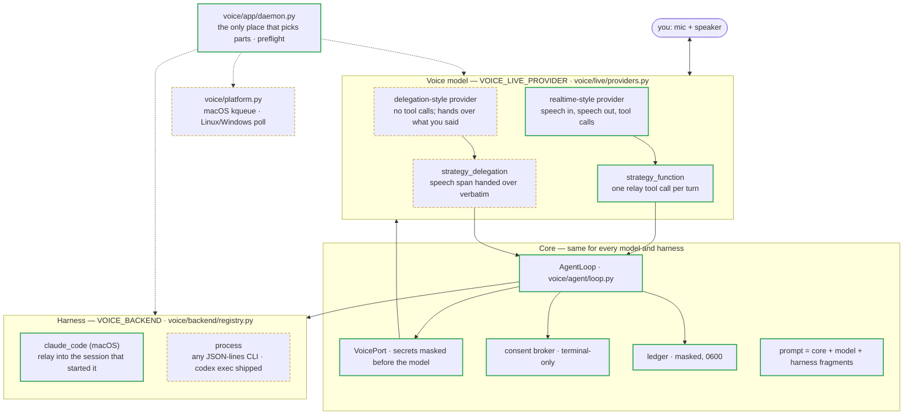

# Better Call GPT — guide

The reference half of the [README](../README.md): the status line, running without the plugin, configuration, how it is built, and tests.

## More

**Status line (terminal).** `bettercallgpt statusline` prints `🎙 voice` while this session's call
is live (`🎙 voice ↻` while the voice connection is renewed). With the skill's `uvx` setup the
command is `uvx --from git+https://github.com/insta-fusion/bettercallgpt@v0.1.1 bettercallgpt statusline`;
put it in `~/.claude/settings.json` → `statusLine`, or ask your agent to (update the version in it
after an upgrade). The desktop app shows no status line — use `/bettercallgpt:status`.

**Keep voice turns understood after `/compact`:** add [docs/HOST-INSTRUCTIONS.md](HOST-INSTRUCTIONS.md)
to your `CLAUDE.md`.

**Without the plugin.** Install the command once — `uv tool install "git+https://github.com/insta-fusion/bettercallgpt@v0.1.1"` (on Linux also install PortAudio) — or put the `uvx --from …` prefix above in front of every `bettercallgpt` below. Add [docs/HOST-INSTRUCTIONS.md](HOST-INSTRUCTIONS.md) to your
`CLAUDE.md` (or `AGENTS.md`) once, so the agent treats `⟨v#…⟩` lines as you speaking. Then ask
the agent to start voice; it runs, from its own Bash tool:

```sh
NONCE=k7q2m9 bettercallgpt --nonce k7q2m9 start
```

The nonce is any fresh random token, written twice (`NONCE=<n>` and `--nonce <n>`). The
daemon then proves it belongs to the session that started it, with zero keystrokes: it
descends from that session's `claude` process, the session's own transcript holds exactly
one fresh Bash call carrying the nonce, its own environment carries `NONCE=<n>`, and each
nonce binds once. In an [Orca](https://github.com/stablyai/orca) terminal pane, `start` tries
the pane first: when the pane proof holds (the nonce is on that pane's screen inside the running
Bash call), it binds with `--terminal "$ORCA_TERMINAL_HANDLE"` and the daemon can tell you when
a permission prompt is waiting. It uses Orca's own agent-wait signal (the `agentWait` field of
`orca terminal show --json`) and reads the pane — never types into it — for the prompt's
wording and options. Either one is enough to tell you: when Orca reports a wait you hear it
even if the pane cannot be read, and when Orca reports none, or is too old to report it, or
the call fails, it falls back to reading the pane. Otherwise (no
`orca` CLI, a stale handle, tmux, a headless session) the start proceeds exactly as above.
`bettercallgpt doctor` shows it as `orca_pane`; export `BETTERCALLGPT_ORCA_PANE=0` to skip it.
Approvals are always answered on the keyboard. The session id comes from
`CLAUDE_CODE_SESSION_ID` (`VOICE_SESSION_ID` overrides it). The controls address a session by id: from the agent's own Bash
tool the id is already in the environment, so the agent (or you, by asking it) runs

```sh
bettercallgpt status      # JSON snapshot: phase, relay, relay_count, reconnecting, session, …
bettercallgpt stop
```

From any other shell, pass the id — `bettercallgpt --session <id> stop` — where `<id>` is the
session's `CLAUDE_CODE_SESSION_ID` (the name of its state directory under
`~/.local/state/bettercallgpt/`). Without it the command targets a session named `default`.

## Configuration

Read from the environment first, then the `.env` (never shadowing the real environment).
Installed copies read `~/.config/bettercallgpt/.env` (`$XDG_CONFIG_HOME` when set;
`%APPDATA%\bettercallgpt\.env` on Windows) and keep state in `~/.local/state/bettercallgpt`
(`$XDG_STATE_HOME` when set; `%LOCALAPPDATA%\bettercallgpt` on Windows); a source checkout reads `.env` at its root.

| Name | Default | Meaning |
|---|---|---|
| `AZURE_OPENAI_ENDPOINT`, `AZURE_OPENAI_API_KEY` | — | Azure Voice Live credentials |
| `OPENAI_API_KEY` | — | with `VOICE_LIVE_PROVIDER=openai` |
| `VOICE_LIVE_PROVIDER` | `voice_live` | `voice_live` \| `openai` \| `gpt_live` |
| `VOICE_GPT_LIVE_ENDPOINT`, `VOICE_GPT_LIVE_API_KEY` | — | with `VOICE_LIVE_PROVIDER=gpt_live` (its own Azure resource; use headphones) |
| `VOICE_GPT_LIVE_MODEL` | `gpt-live-1` | GPT-Live deployment |
| `VOICE_TRANSCRIBE_MODEL` | `whisper-1` | Voice Live: speech-to-text model for your side of the call |
| `VOICE_REASONING_EFFORT` | unset | Voice Live: the model's reasoning effort, when set |
| `VOICE_MODEL` | `gpt-realtime-2.1` (`gpt-realtime` on OpenAI) | realtime deployment / model |
| `VOICE_NAME` | `marin` | voice |
| `VOICE_LIVE_VAD` | `azure_semantic_vad` | Voice Live: server turn detection (duplex + barge-in stay on; OpenAI always uses `server_vad`) |
| `VOICE_LIVE_API_VERSION` | `2026-07-15` | Voice Live API version |
| `VOICE_LIVE_HOST` | from the endpoint | Voice Live: host override |
| `VOICE_BACKEND` | `claude_code` | `claude_code` \| `process` |
| `VOICE_PROCESS_ARGV`, `VOICE_PROCESS_DIALECT` | —, `codex_exec` | the child agent for `process` |
| `VOICE_BACKEND_CWD` | current directory | working directory for the `process` agent |
| `VOICE_IDLE_MINUTES` | `10` | quiet minutes before goodbye; `0` = never |
| `VOICE_SESSION_ROLLOVER_MINUTES` | `55` | renew the voice provider session before its own limit (a fresh one takes over with a short recap); `0` = off |
| `VOICE_SESSION_MAX_MINUTES` | none | hard session cap |
| `VOICE_SESSION_ID` | `CLAUDE_CODE_SESSION_ID` | the session every command (`start` and the controls) addresses — **environment only**; precedence `--session` → `VOICE_SESSION_ID` → `CLAUDE_CODE_SESSION_ID` → `default` |
| `VOICE_LISTEN_STATE_DIR` | see above | status + ledger directory — **environment only** (`export`; ignored in `.env`) |

A statusline or any other reader of the daemon's `status.json` must use the same
`VOICE_LISTEN_STATE_DIR` (installed copies default to `~/.local/state/bettercallgpt`).

## How it is built

Solid border = proven in a live call (a provider style: with at least one provider). Dashed = shipped and unit-tested, not yet proven live.
Which providers fill each slot today is in [Works with](#works-with). Want another harness or voice
model? A harness is one `Backend` plus a registry row; a model is one `LiveSession` (+ `Strategy`)
plus a registry row.



Every seam is a protocol: a new voice model is a `LiveSession` + `Strategy` + one row in
`voice/live/providers.py`; a new harness is a `Backend` + one row in
`voice/backend/registry.py`. The daemon is the only module that names concrete parts, and
`bettercallgpt doctor` / `bettercallgpt --status` refuse an unsupported model ×
harness × OS combination before any microphone or paid connection is opened. The voice
model owns meaning (`voice/prompts/`); code decides nothing except consent. The reasons are
in [voice/DESIGN.md](../voice/DESIGN.md).

## Tests

```sh
python -m unittest discover -s voice/tests -t . -p 'test_*.py'   # voice/ suite, offline
python -m unittest discover -s tests -t . -p 'test_*.py'         # launcher + parity check
```

The voice/ suite is offline and silent, POSIX-only (the process backend sends SIGINT).
One live smoke test (a real `codex exec`) runs only when you opt in with `VOICE_LIVE_TESTS=1`.

